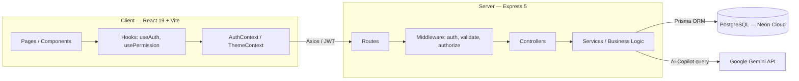
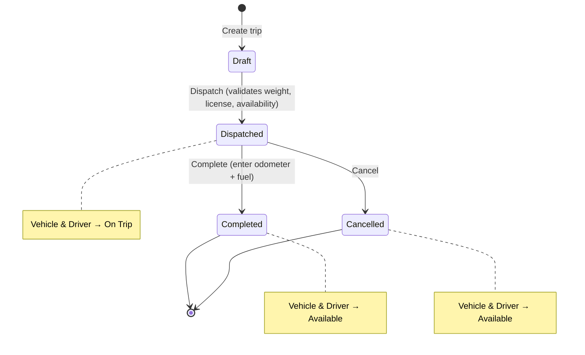
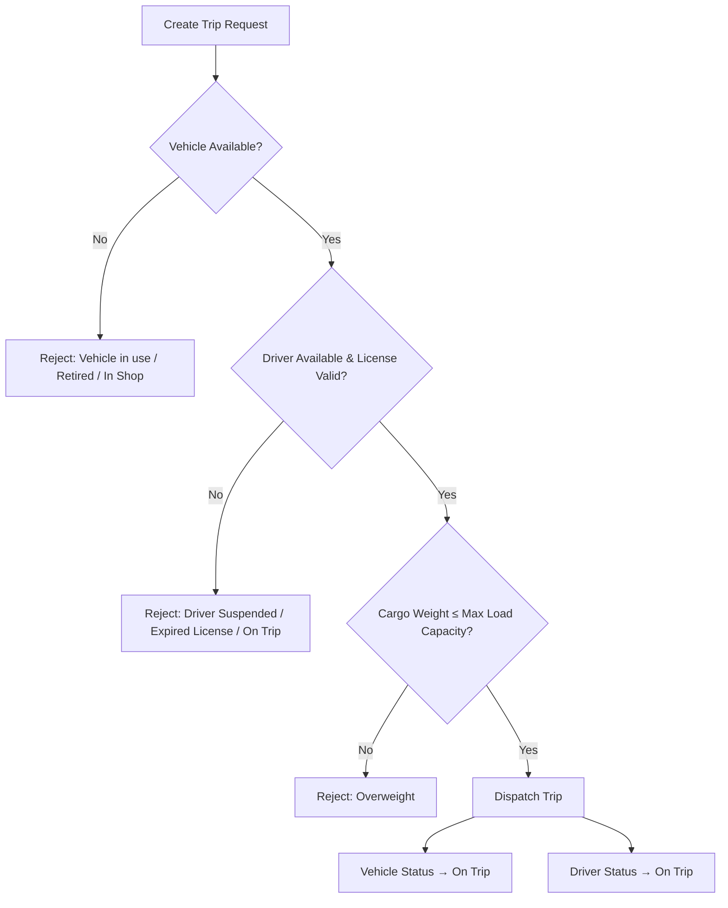
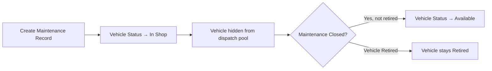
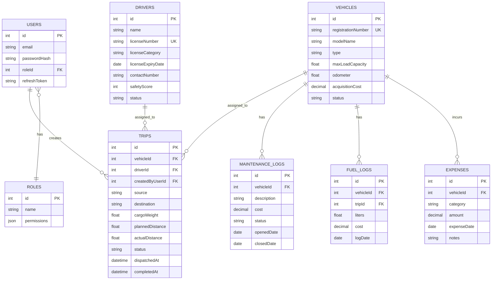

# TransitOps — Smart Transport Operations Platform

A production-ready Fleet ERP system that digitizes vehicle, driver, dispatch, maintenance, and expense management for transport & logistics operations — replacing spreadsheets and manual logbooks with a centralized, rule-enforced platform.

Built end-to-end in an **8-hour hackathon**. Every mandatory requirement and every bonus feature from the spec is implemented.

---

## Table of Contents

- [Overview](#overview)
- [Target Users](#target-users)
- [System Architecture](#system-architecture)
- [Core Workflows](#core-workflows)
- [Database Schema](#database-schema)
- [Wireframes / Mockups](#wireframes--mockups)
- [Feature Overview](#feature-overview)
- [Tech Stack](#tech-stack)
- [Quick Start](#quick-start)
- [Login Credentials](#login-credentials)
- [Project Structure](#project-structure)
- [API Endpoints](#api-endpoints)
- [RBAC Matrix](#rbac-role-based-access-control)

---

## Overview

Many logistics companies still run transport operations on spreadsheets and manual logbooks — leading to scheduling conflicts, underutilized vehicles, missed maintenance, expired driver licenses, and poor visibility into cost and performance.

**TransitOps** centralizes the entire lifecycle — vehicle registration, driver management, dispatching, maintenance, fuel/expense logging, and analytics — with business rules enforced automatically so bad states (double-booked vehicles, overloaded trips, expired-license drivers on the road) simply can't happen.

## Target Users

| Role | Responsibility |
|------|-----------------|
| **Fleet Manager** | Oversees fleet assets, maintenance, vehicle lifecycle, and operational efficiency |
| **Dispatcher** | Creates trips, assigns vehicles and drivers, monitors active deliveries |
| **Safety Officer** | Ensures driver compliance, tracks license validity, monitors safety scores |
| **Financial Analyst** | Reviews operational expenses, fuel consumption, maintenance costs, and profitability |
| **Admin** | Full system access and configuration |

---

## System Architecture



---

## Core Workflows

### Trip Lifecycle



### Dispatch Validation Flow



### Maintenance Workflow



---

## Database Schema



---

## Wireframes / Mockups

Initial UI wireframes were designed in Excalidraw during the planning phase, covering the Dashboard, Vehicle Registry, Trip creation flow, and Analytics views. The delivered UI (React + Tailwind + shadcn/ui) follows this layout with a persistent sidebar, top KPI cards, and a responsive data-table-driven content area.

> Wireframe reference kept as an internal planning artifact — no live link is published with this README.

---

## Feature Overview

TransitOps ships **every mandatory requirement and every bonus feature** from the original spec:

- **Access & Security** — JWT auth with refresh rotation, full RBAC across five roles
- **Fleet & Driver Management** — full CRUD, status lifecycle, license/expiry tracking
- **Trip Management** — end-to-end dispatch flow with automatic rule enforcement (weight limits, availability, license validity)
- **Maintenance** — automatic vehicle status transitions, hidden-from-dispatch handling
- **Finance** — fuel logs, expense tracking, auto-computed operational cost and ROI
- **Analytics & Reporting** — dashboard KPIs, fleet utilization, fuel efficiency, CSV/PDF export
- **Extras** — AI Fleet Copilot (Gemini-powered natural language queries), dark mode, license-expiry email reminders, document management, search/filter/sort throughout

*(Full field-level requirement list available on request — kept out of this README for readability.)*

---

## Tech Stack

| Layer | Technology |
|-------|-----------|
| Frontend | React 19, Vite, Tailwind CSS v4 |
| UI Components | shadcn/ui + Radix UI |
| State | TanStack Query v5 |
| Forms | React Hook Form + Zod |
| Charts | Recharts |
| Animation | Framer Motion |
| Notifications | Sonner |
| Backend | Express 5 (CommonJS) |
| ORM | Prisma 5 |
| Database | PostgreSQL (Neon cloud) |
| Auth | JWT (access + refresh token rotation) |
| Validation | Zod (server-side) |
| AI Copilot | Google Gemini API |

---

## Quick Start

### Prerequisites
- **Node.js 18+** — [Download](https://nodejs.org)
- Internet connection (for Neon PostgreSQL cloud DB)

### One-Click Setup
```bat
# Windows: Double-click setup.bat OR run in terminal:
setup.bat
```

This will:
1. Install server dependencies
2. Generate Prisma client
3. Push schema to Neon cloud DB
4. Seed the database with demo data
5. Install client dependencies

### Start the Application
```bat
# Windows: Double-click start.bat OR:
start.bat
```

- **Server** runs on: http://localhost:5000
- **Client** runs on: http://localhost:5173

### Manual Setup (if setup.bat fails)

```bash
# Server
cd server
npm install
npx prisma generate
npx prisma db push
node prisma/seed.js
npm run dev

# Client (separate terminal)
cd client
npm install
npm run dev
```

---

## Login Credentials

All accounts use password: **password123**

| Email | Role | Access |
|-------|------|--------|
| admin@transitops.com | Admin | Full CRUD everything |
| fleet@transitops.com | Fleet Manager | Fleet, Maintenance, Analytics |
| dispatch@transitops.com | Dispatcher | Trips, Drivers (view), Fleet (view) |
| safety@transitops.com | Safety Officer | Drivers, Dashboard |
| finance@transitops.com | Financial Analyst | Fuel, Expenses, Analytics, Finance |

---

## Project Structure

```
TransitOps/
├── client/          # React 19 + Vite + Tailwind v4 frontend
│   ├── src/
│   │   ├── pages/        # 8 full-featured pages
│   │   ├── components/   # DataTable, StatusBadge, KpiCard, etc.
│   │   ├── services/     # API layer (axios)
│   │   ├── hooks/        # useAuth, usePermission, useDebounce, etc.
│   │   ├── context/      # AuthContext, ThemeContext
│   │   └── constants/    # RBAC_MAP, ROLES, VEHICLE_TYPES, etc.
│   └── requirements.txt  # Client dependency list
│
├── server/          # Express 5 + Prisma + PostgreSQL backend
│   ├── src/
│   │   ├── routes/       # 9 route files
│   │   ├── controllers/  # Thin controllers
│   │   ├── services/     # Business logic
│   │   ├── middleware/   # auth, validate, authorize, errorHandler
│   │   └── validators/   # Zod schemas for all routes
│   ├── prisma/
│   │   ├── schema.prisma # Full database schema
│   │   └── seed.js       # Demo data seeder
│   └── requirements.txt  # Server dependency list
│
├── setup.bat        # One-click setup script
└── start.bat        # One-click start script
```

---

## API Endpoints

| Method | URL | Description |
|--------|-----|-------------|
| POST | /api/v1/auth/login | Login |
| POST | /api/v1/auth/refresh | Refresh access token |
| POST | /api/v1/auth/logout | Logout |
| GET | /api/v1/auth/me | Get current user |
| GET/POST | /api/v1/vehicles | List/Create vehicles |
| GET/PUT | /api/v1/vehicles/:id | Get/Update vehicle |
| PATCH | /api/v1/vehicles/:id/retire | Retire vehicle |
| GET/POST | /api/v1/drivers | List/Create drivers |
| PATCH | /api/v1/drivers/:id/status | Update driver status |
| GET/POST | /api/v1/trips | List/Create trips |
| PATCH | /api/v1/trips/:id/dispatch | Dispatch trip |
| PATCH | /api/v1/trips/:id/complete | Complete trip |
| PATCH | /api/v1/trips/:id/cancel | Cancel trip |
| GET/POST | /api/v1/maintenance | List/Create maintenance |
| PATCH | /api/v1/maintenance/:id/close | Close maintenance |
| GET/POST | /api/v1/fuel-logs | List/Create fuel logs |
| GET/POST | /api/v1/expenses | List/Create expenses |
| GET | /api/v1/expenses/totals | Operational cost totals |
| GET | /api/v1/dashboard | Dashboard KPIs |
| GET | /api/v1/analytics | Full analytics data |
| GET | /api/v1/analytics/export.csv | Export CSV |
| POST | /api/v1/copilot/query | AI Fleet Copilot |

---

## RBAC (Role-Based Access Control)

| Module | Admin | Fleet Mgr | Dispatcher | Safety Off. | Financial |
|--------|-------|-----------|------------|-------------|-----------|
| Dashboard | ✓ Full | ✓ Full | ✓ Full | View | View |
| Fleet | ✓ Full | ✓ Full | View | — | View |
| Drivers | ✓ Full | — | View | ✓ Full | — |
| Trips | ✓ Full | — | ✓ Full | — | View |
| Maintenance | ✓ Full | ✓ Full | — | — | View |
| Fuel & Expenses | ✓ Full | — | — | — | ✓ Full |
| Analytics | ✓ Full | ✓ Full | — | — | ✓ Full |
| Settings | ✓ Full | — | — | — | — |

---
## Notes
 
- No live demo link is published with this README.
- Diagrams use [Mermaid](https://mermaid.js.org/) syntax — they render automatically on GitHub.